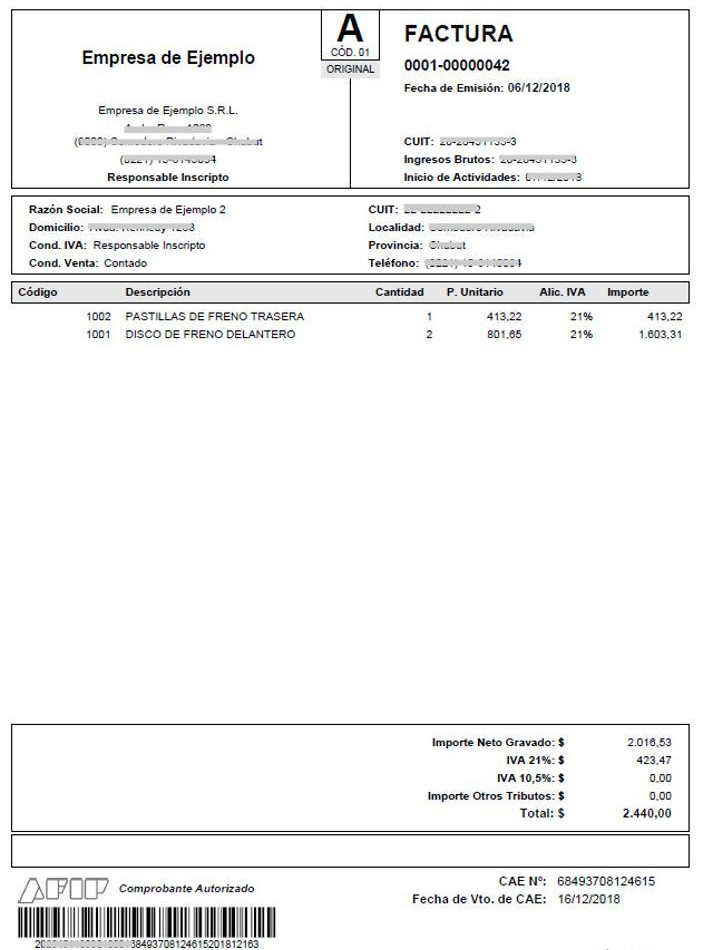

# Elcor Invoice Manager

## Introduction
Hi, I'm Blas and this is my final project for the CS50 Introduction to Computer Science course at Harvard.
This little project is based on a need, and following the advice of my dear friends of CS50, of a company for which I do small technical services, to manage invoices in a more efficient way.
The development of this project is, for the moment, only mine, but it could have more contributions in the future (and I hope so too!).
Many thanks to all the CS50 Harvard team, and to you for taking a look at my project.

## Description

**Elcor Invoice Manager** project allows users to gather data from invoices, append the data into Excel files (`.xlsx`), and reorganize them into folders based on the emitter/receiver company and date to find each of them easily.
<br><br>
The program was mainly designed to operate with invoices generated by the main tax regulation body in Argentina: AFIP (Administración Federal de Ingresos Brutos), although it can read all kinds of valid invoices, of various formats and in several languages, using api calls and a complex but powerful OCR and AI system.
<br><br>
*ElcorInvoiceManager* can read files and search for information in pdf(recommended), jpg, jpeg and png formats.
In the case of the latter formats, make sure that the information is clear and that the image does not contain shadows or anything else that might make it difficult to read.
<br><br>
You will notice that the program does not need to make API calls for all the invoices that have been issued by the Argentinean AFIP system, as ElcorInvoiceManager it has its own logic to extract information from them.
Here is an example of an AFIP system generated invoice(in spanish language as they are created):



Feel free to parse invoices that do not follow this format, but take into account that for every invoice the program will make API calls, potentially taking longer and resulting in excessive cost on the long run.

## Getting Started

### Clone the repository

This project is hosted on [GitHub](https://github.com/Blasidelgado/Elcor_invoice_manager). You can clone the repository to your local machine using the following command:

```
git clone https://github.com/Blasidelgado/Elcor_invoice_manager
```

You can now navigate to the project directory using:

    cd Elcor_invoice_manager
    

<br>

### Installing Python

Before running the project, please make sure you have the following prerequisites installed:

- **Python 3**: Install Python 3 by following the instructions provided on the official Python website: [python.org](https://www.python.org/downloads/)

- **pip**: Ensure that `pip` is installed. You can verify this by running the following command:


    ```
    pip --version
    ```

If pip is not installed, you can install it by following the instructions provided in the [official pip documentation](pip.pypa.io)

- **Tkinter**: Tkinter is commonly bundled with Python, but in some cases, it may need to be installed separately. To install Tkinter, run the following command:

    - macOS:
        ```shell
        brew install python-tk
        ```

    - Linux:
        ```shell
        sudo apt-get install python3-tk
        ```

    - Windows:
    Tkinter is included by default with most Python distributions for Windows.

    <br>

### Installing Dependencies
To install the required packages for this project, follow the steps below:

1. **Setting up a Virtual Environment (Optional)**

   It's recommended to set up a virtual environment to keep your project dependencies isolated. If you prefer not to use a virtual environment, you can skip this step.

    - **macOS/Linux**:

    ```shell
    python3 -m venv venv
    source venv/bin/activate
    ```

    - **Windows**:

    ```shell
    python3 -m venv venv
    venv\Scripts\activate
    ```

2. **Installing Required Packages**

    Use `pip` to install the necessary packages globally or within the virtual environment:

    ```shell
    pip install -r requirements.txt
    ```

- `python-dotenv`: Enables reading environment variables from a .env file.
- `pdfplumber`: Extracts text and metadata from PDF files.
- `openpyxl`: Manipulates Excel files in Python.
- `veryfi`: OCR API SDK that parses invoice data from various formats.

<br>

### Configuration

1. Copy the provided .env.template file and rename it to .env

2. Open the `.env` file and replace the placeholder text for each key with your actual values. The variables may include:

   - `CLIENT_ID`: Here goes your CLIENT_ID.
   - `CLIENT_SECRET`: Here goes your CLIENT_SECRET.
   - `USERNAME`: Here goes your USERNAME.
   - `PASSWORD`: Here goes your PASSWORD.

   <br>

   Make sure to save the `.env` file with your changes.

    If you don't have these keys yet, you can obtain them by following the steps below:

   - Go to the [Veryfi website](https://www.veryfi.com/) and create an account or log in if you already have one.
   - Select a suitable plan and subscribe to it.
   - Once you have subscribed, log in to your Veryfi account.
   - Navigate to the "Keys" section or a similar area in your Veryfi account dashboard.
   - Paste the keys values into the corresponding placeholders in the `.env.template` file.
    - Rename the `.env.template` file to `.env`.


   Make sure to save the `.env` file with your changes.

<br>

## Usage
1. **Navigate to the project folder**: Open the terminal and change the directory to the project folder. For example:

    ```
    cd /path/to/project/folder
    ```

2. **Run the main script**: Once you are in the project folder, you can run the main.py script. Use the python command followed by the script name to execute it. For example:

```
python main.py
```
If you're using Python 3, you may need to use the python3 command instead:

```
python3 main.py
```

3. **Fill required data**: At this point, you will be presented with a little GUI asking you for some information. Let's gets started:

- **Company name**: Here will be your name or the name of the company for which the invoices will be administered. It is important for the correct functioning of the program that the name matches the name that appears on the invoices. <br>
In the case that we are talking about a company, **it is not necessary to specify the type of the company**, it is better and safer to just put the name without specifying its type.

- **Directory selection**: Here you will input the folder where all your unread invoices are located. Program will not remember already parsed documents so make sure you dont put inside any duplicates or scan a single document twice by moving it accidently.
<br>
Program will move the read files to subfolders, depending on the date the invoices were issued.
The new address of the invoices will be:
<br><br>
    *selected_folder/year/month*
<br><br>

Keep in mind program will also **rename the file** for better localization, using the following syntax:
<br><br>
*{counterpart company} {issue day-issue month-issue year}*
<br><br>

Therefore, the new file path will be:
<br><br>
    *selected_folder/year/month/{counterpart_company}{issue_day-issue_month-issue_year}.{format}*
<br><br>
 

- **xlsl file selection**: Finally, the program needs a .xlsl file in order to append gathered data into.
The program will write the information in the first free row of the active sheet of that file.
It is advisable, before running the program, to take a look to see where the last line of your .x file is located.
Also, the program will write in the same cell format as the previous row, so it is also a good idea to format the rows correctly before running the program.
Note that the program will write this data in this order:
    1. Invoice issue date, in text format.
    2. Invoice's counterpart company, in text format
    3. Invoice concept/s, in text format.
    4. Total amount, in number format with two decimal places. If the counterpart company is the issuer of the invoice, the number written will be negative.
<br><br>

If program fails to gather mentioned data, file will not be appended nor moved and renamed.

After you have submitted all the information above, you can proceed to run the program by pressing the start button at the center of the screen.
All the necessary information will be displayed through the console at the bottom of the window.
<br>

## Acknowledgements

I would like to acknowledge and extend my gratitude to the following individuals and organizations for their contributions, support, and inspiration in the development of this project:

- [Lucas](https://github.com/lucasdaddiego): Close friend that heavely contributed to this project. 
- [Veryfi ](https://veryfi.com): Excellent OCR API to scan and gather information from invoices and all kind of billing documents.
- [CS50 Harvard Team](https://cs50.harvard.edu/college/2023/fall/staff/): Amazing team. Just do take CS50 and see it yourself!

## Contributing

Contributions are welcome! If you would like to contribute to this project, please follow these guidelines:

- Report any bugs or issues by opening a new [issue](https://github.com/Blasidelgado/Elcor_invoice_manager).
- Suggest new features or improvements by opening a new [feature request](https://github.com/Blasidelgado/Elcor_invoice_manager/issues).
- Submit your contributions via [pull requests](https://github.com/Blasidelgado/Elcor_invoice_manager).

Thank you for your interest in contributing to this project!

